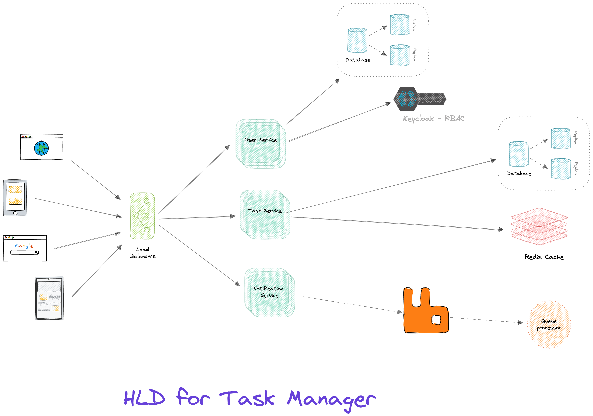

# High Traffic FastAPI Application Design

## 1. Application Architecture Overview

This architecture is designed to handle **millions of tasks** and **concurrent users** while ensuring **scalability**, **high availability**, and **fault tolerance**. The application is built using **FastAPI** for high-performance API handling, **PostgreSQL** for persistent data storage, **Redis** for caching, **Celery** for background task processing, and **Keycloak** for authentication and authorization. The core components of the architecture are listed below:

- **FastAPI**: The main web framework used for building APIs. It is lightweight, asynchronous, and scalable.
- **PostgreSQL**: Primary database for persistent storage of user data, tasks, and other entities.
- **Keycloak**: Used for authentication, authorization, and **Role-Based Access Control (RBAC)**.
- **Redis**: Caches frequently accessed data, reducing the load on the database and enhancing performance.
- **Celery + RabbitMQ**: Celery is used for background task processing, while RabbitMQ serves as the message broker.
- **Prometheus & Grafana**: For monitoring system performance and health metrics.
- **ELK Stack (Elasticsearch, Logstash, Kibana)**: For centralized logging and troubleshooting.





---

## 2. Database Design

### 2.1. **PostgreSQL as the Primary Database**

To handle high traffic and large datasets efficiently, PostgreSQL is configured with the following optimizations:

#### **Sharding and Replication:**
- **Sharding** is used to split large tables across multiple instances, improving scalability and reducing query latency.
- **Master-Slave Replication** ensures high availability, where the **master** handles write operations and **read replicas** serve read queries. This setup improves the overall read performance.

#### **Partitioning:**
- Large tables (such as `tasks`) are partitioned based on logical criteria like `user_id`, `task_status`, and `created_at` to improve query performance.

#### **Indexes:**
- **B-tree** indexes for general-purpose queries.
- **GIN indexes** for full-text search or complex queries.
- **Composite indexes** for frequent query patterns (e.g., filtering by `user_id` and `task_status`).

#### **Connection Pooling:**
- **PgBouncer** is used to manage database connections and reduce connection overhead, especially under heavy load.

---

## 3. API Scalability and Load Balancing

### 3.1. **Handle Millions of Tasks and Concurrent Users**

To ensure the system can scale and handle millions of tasks and concurrent users, the following design principles are applied:

#### **Microservices Architecture**:
- The application follows a **microservices architecture** where each service is designed for specific functionalities:
  - **Task Management Service**: Handles task-related CRUD operations.
  - **User Management Service**: Manages user data, roles, and authentication.
  - **Notification Service**: Handles background notifications, emails, and other messaging tasks.
  
  Each service can be independently scaled based on demand.

#### **Load Balancing**:
- An **Nginx** or **HAProxy** load balancer is placed in front of the FastAPI application instances. It distributes incoming requests across available service instances and ensures high availability during traffic spikes.

#### **Auto-Scaling**:
- The application is containerized using **Docker** and deployed in a **Kubernetes** cluster. Kubernetes is configured for **auto-scaling**, where the number of pods (application instances) adjusts based on traffic load.
  
  Auto-scaling ensures that additional resources are allocated during high traffic periods, helping the system to handle millions of concurrent users.

---

### 3.2. **Ensure High Availability and Scalability**

#### **High Availability**:
- **Database Replication** ensures that there is always a read replica available, reducing the risk of downtime. The **master-slave** setup ensures that, in the event of a failure, the system can quickly promote a slave to master.
- **FastAPI App** is distributed across multiple containers managed by **Kubernetes** to ensure that even if one instance goes down, traffic is automatically routed to healthy instances.

#### **Scalability**:
- **Horizontal Scaling** is implemented by **Kubernetes**. When the demand increases, new pods (instances of the FastAPI app) are automatically spun up.
- **Vertical Scaling** ensures that each application instance can handle more tasks by adding more CPU and memory resources.

---

## 4. Authentication with Keycloak (RBAC)

### 4.1. **Role-Based Access Control (RBAC)**
Keycloak is integrated for handling authentication and role-based access control (RBAC):

- **Roles** are defined in Keycloak, such as `admin`, `user`, and `manager`.
- Upon user login, Keycloak issues a **JWT token** containing the user’s roles and claims.
- The JWT token is validated in each FastAPI request using the **OAuth2** scheme.

Example of a protected route:

```python
from fastapi import Depends, HTTPException
from fastapi.security import OAuth2PasswordBearer

oauth2_scheme = OAuth2PasswordBearer(tokenUrl="token")

def get_user_roles(token: str = Depends(oauth2_scheme)):
    payload = decode_jwt_token(token)
    roles = payload.get("realm_access", {}).get("roles", [])
    return roles

def role_required(roles: List[str]):
    def role_check(roles: List[str] = Depends(get_user_roles)):
        if not any(role in roles for role in roles):
            raise HTTPException(status_code=403, detail="Forbidden")
    return role_check
```

### 4.2. **API Endpoint Security**
- Routes are secured with role-based access controls (RBAC), ensuring that only authorized users can access specific endpoints (e.g., `admin` can access `/admin` routes).

---

## 5. Logging and Monitoring

### 5.1. **Logging**
- Structured logging is implemented using **Loguru** and **Python's built-in logging** libraries. Logs are stored in a JSON format for easy querying and analysis.

### 5.2. **Centralized Logging with ELK Stack**
- Logs are forwarded to an **ELK Stack** (Elasticsearch, Logstash, and Kibana) for centralized logging, enabling efficient log monitoring, querying, and troubleshooting.

### 5.3. **Monitoring with Prometheus & Grafana**
- **Prometheus** collects metrics such as **request count**, **response times**, **error rates**, and **system health**.
- **Grafana** is used to create interactive dashboards for visualizing these metrics.

### 5.4. **Distributed Tracing**
- **OpenTelemetry** is used for distributed tracing, allowing you to track requests as they pass through various microservices, making it easier to spot bottlenecks.

---

## 6. Caching and Message Queuing

### 6.1. **Caching with Redis**
- **Redis** caches frequently accessed data, such as task information, user profiles, and popular queries. This reduces the load on PostgreSQL and speeds up response times.

Example caching strategy with Redis:

```python
import redis
from fastapi import FastAPI

app = FastAPI()
r = redis.Redis(host='localhost', port=6379, db=0)

@app.get("/task/{task_id}")
async def get_task(task_id: str):
    task_data = r.get(task_id)
    if task_data:
        return {"task": task_data}
    else:
        task_data = f"Task {task_id} data"
        r.set(task_id, task_data, ex=3600)  # Cache for 1 hour
        return {"task": task_data}
```

### 6.2. **Message Queuing with Celery and RabbitMQ**
- **Celery** handles background tasks, such as sending emails or performing long-running tasks.
- **RabbitMQ** serves as the message broker for Celery, queuing tasks for asynchronous processing.

Example Celery task:

```python
from celery import Celery

celery = Celery('tasks', broker='pyamqp://guest@localhost//')

@celery.task(bind=True, default_retry_delay=60, max_retries=3)
def send_email_task(self, task_id):
    try:
        # Simulate email sending
        print(f"Sending email for task: {task_id}")
    except Exception as e:
        raise self.retry(exc=e)
```

---

## 7. Conclusion

The architecture ensures that the application can handle **high traffic**, maintain **scalability**, and provide **high availability**. With the use of **PostgreSQL**, **Keycloak**, **Redis**, **Celery**, and **Prometheus**, we ensure that the application is **robust**, **secure**, and **high-performing**. The system is also highly **fault-tolerant**, and **real-time monitoring** helps in proactive troubleshooting.

---

### **Summary**:
- **PostgreSQL** is optimized with **sharding**, **replication**, and **partitioning** to handle large datasets.
- **Keycloak** enables **role-based authentication** and **authorization**.
- **Redis** caching and **Celery** background task processing ensure optimal performance.
- **Logging** is centralized through **ELK Stack**, and **monitoring** is done with **Prometheus** and **Grafana**.
